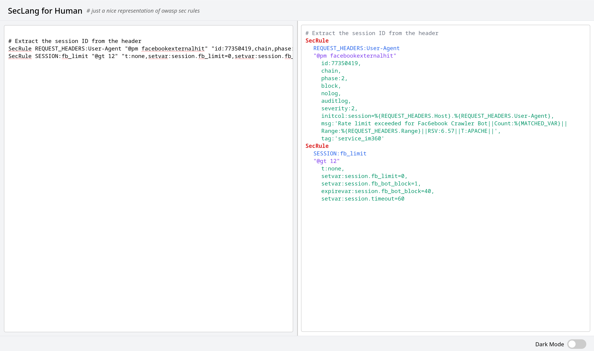
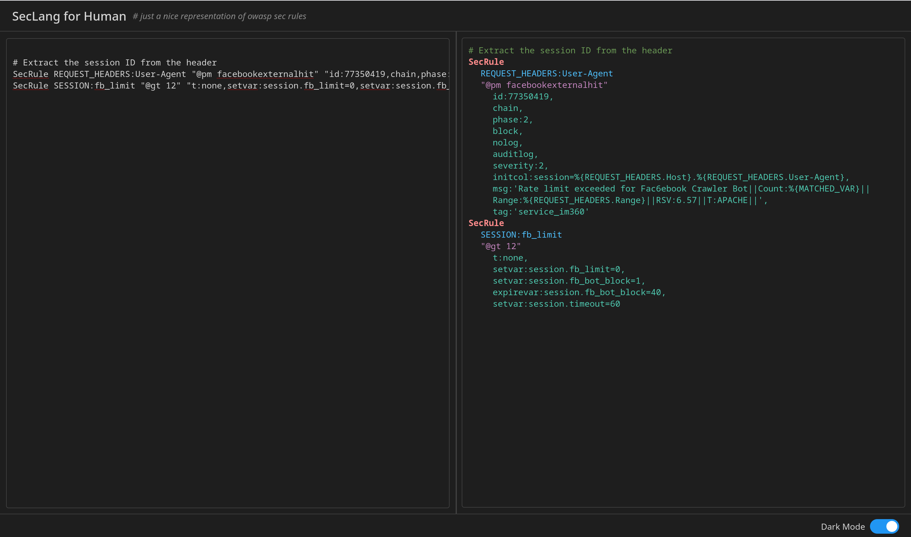

# SecLang for Human

A lightweight web-based formatter for ModSecurity (OWASP) rules, making them easier to read and understand. This tool processes rules input and provides a clean, human-readable output.

## Features
- **Real-Time Parsing:** Instantly formats and displays OWASP rules.
- **Split View:** Input area on the left, formatted output on the right.
- **Light/Dark Mode Support:** Toggle between themes for better readability.
- **Resizable Panels:** Adjust panel width to suit your preferences.

## How to Use
1. Visit the live version: [SecLang for Human](https://yourusername.github.io/owasp-sec-rule-formatter).
2. Paste your ModSecurity rules into the left panel.
3. View the formatted result in the right panel.

## UI Screenshots

